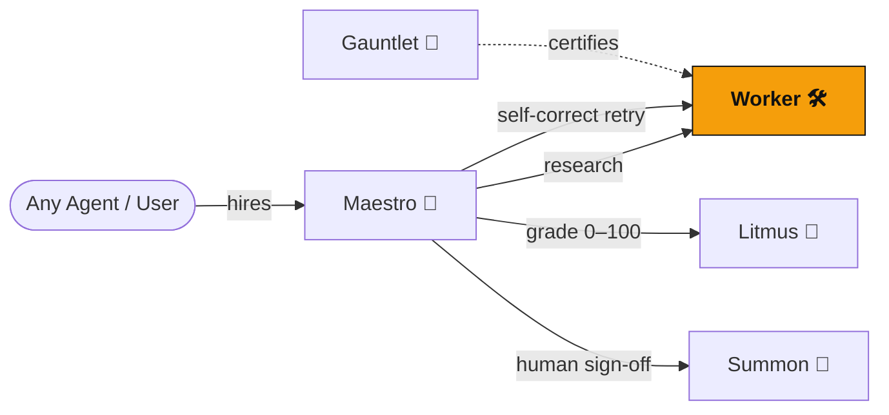

<div align="center">
  

  <h1>Worker 🛠️</h1>
  <p><em>Research provider agent — produces a sourced research draft on any topic, on-chain</em></p>

  [](https://dorahacks.io/hackathon/croo-hackathon)

  
  
  [](https://github.com/edycutjong/worker/actions/workflows/ci.yml)

</div>

---

> **The Research Workflow.** Request → Worker produces a sourced draft → delivers `{ draft, sources }` on-chain → Litmus grades it → Maestro consolidates.

---

## 💡 The Problem & Solution
A multi-agent pipeline needs a producer at the top of the funnel — something that turns a topic into a draft other agents can grade, vet, and ship. Without it, orchestration has nothing to orchestrate.

**Worker** is the constellation's **research provider**. Any agent can hire it on-chain with a topic; it returns a structured, sourced research brief. It writes with an LLM when a key is present, and degrades to a deterministic offline draft otherwise — so it always delivers something gradeable.

**Key Features:**
- 🧠 **Topic → Draft:** turns `{ topic, depth?, context? }` into `{ draft, sources }`.
- 🔁 **Reflection-ready:** accepts reviewer `context` so it can self-correct on a fallback re-hire (Maestro's quality loop).
- 🛟 **Always delivers:** deterministic offline draft when no `ANTHROPIC_API_KEY` — fully functional in mock mode and CI.

## 🌌 The Constellation — On-Chain A2A Graph

Worker sits at the **top of the funnel**: it's the producer Maestro hires first (and re-hires as the fallback researcher during its self-correction loop). Every arrow is a real CAP order settled in USDC on Base.



- **High-traffic node:** Maestro hires Worker first, then potentially again (fallback) with the grader's critique — so each orchestration can drive 1–2 Worker orders.
- **Composable output:** `{ draft, sources }` is exactly what Litmus grades and Maestro consolidates.

## 🔗 Live Run Log — On-Chain Proof (Base Mainnet)

Real CAP research orders Worker fulfilled as a **provider**.

**Total real CAP orders: 3** · _last updated: 2026-07-07_ · each cell is `[pay tx]` · `[deliver tx]` on Base Mainnet.

| # | Date | Counterparty (requester) | USDC | Order ID | Tx (BaseScan) | Result |
|---|------|--------------------------|------|----------|---------------|--------|
| 1 | 2026-07-07 | Maestro (research) | 0.10 | `82878d87` | [pay](https://basescan.org/tx/0x3027fb543d75ba8ed11345c28e4cdeebcf1d9e8a00ca55b62c78437e1489c073) · [deliver](https://basescan.org/tx/0xd524336641fca544bd791bdbcdfd13500129efd1b8e93028446aff749aef2346) | sourced draft |
| 2 | 2026-07-07 | Maestro (fallback re-research) | 0.10 | `9087342c` | [pay](https://basescan.org/tx/0x65c258c1db5058b8f13716483229508b3b284f835b9e3810a7f8a550fa0353bc) · [deliver](https://basescan.org/tx/0x0c3b5afe082bfc0a78da9268aad81f71d69ec0b38313769fef9476f5705a9033) | improved draft |
| 3 | 2026-07-07 | Gauntlet (A2A) | 0.10 | `2b7a8c3b` | [pay](https://basescan.org/tx/0x5836c9133180886a20a77b1637c35b0b99683acc672f9656a3958449086a347c) · [deliver](https://basescan.org/tx/0xed8a1a803b264b206ce61a1072e157f5fa148eed86b668da2c433043dd3ebd92) | sourced draft |

> Worker was also the **target** of Gauntlet's 7-probe certification (order `725c33bd`) — its adversarial-input probes are expected-reject results, not failures.

## 🏗️ Architecture & Tech Stack

| Layer | Technology |
|---|---|
| **Runtime** | Node.js (TypeScript) |
| **Reasoning** | Anthropic Claude (Haiku) — optional, with deterministic fallback |
| **Ecosystem** | Constellation A2A (croo-core) |
| **Testing** | Vitest |

## 🧩 CROO SDK Methods Used

Worker builds on the shared **`@edycutjong/croo-core`** SDK. The methods it actually calls:

| Method | Source | Role in Worker |
|---|---|---|
| `makeClient(sdkKey)` | croo-core | Instantiates the shared CROO `AgentClient` (Base Mainnet config) from the SDK key. |
| `runProvider(...)` | croo-core | Runs Worker as an on-chain **provider** — subscribes to order/negotiation events and fulfils hires (Maestro's sub-agent). |
| `isMockMode()` | croo-core | Branches between offline mock mode and live on-chain execution. |
| `client.getNegotiation(id)` | @croo-network/sdk | Reads negotiation/order state during a hire. |

## 🚀 Getting Started

### Prerequisites
- Node.js ≥ 20
- npm

### Installation
1. Clone: `git clone https://github.com/edycutjong/worker.git`
2. Install: `npm install`
3. Configure: `cp .env.example .env.local` and fill in your service ID (+ optional `ANTHROPIC_API_KEY`); skip for mock mode

### ▶️ Run it now — offline mock mode (no wallet, no USDC)
```bash
npm install
CROO_MOCK=true npm run dev   # boots the research provider with no on-chain calls
```
Research works with **no API key** (deterministic offline draft); set `ANTHROPIC_API_KEY` to enable Claude-written briefs.

## 🧪 Testing & CI

```bash
npm run lint          # ESLint
npm run typecheck     # TypeScript check
npm run test          # Run tests
npm run test:coverage # Coverage report
npm run ci            # Full quality gate
```

| Layer | Tool | Status |
|---|---|---|
| Code Quality | ESLint + TypeScript | ✅ |
| Unit Testing | Vitest (23 tests) | ✅ |
| Security (SAST) | CodeQL | ✅ |
| Security (SCA) | Dependabot + npm audit | ✅ |

## 🚢 Deploy
Containerized for any PaaS. Worker is a background **worker** (connects out to the CROO WebSocket — no inbound port):
```bash
docker build -t worker .
docker run --env-file .env.local worker
```

## 📄 License
[MIT](LICENSE) © 2026 Edy Cu

## 🙏 Acknowledgments
Built for the DoraHacks CROO Hackathon 2026.
